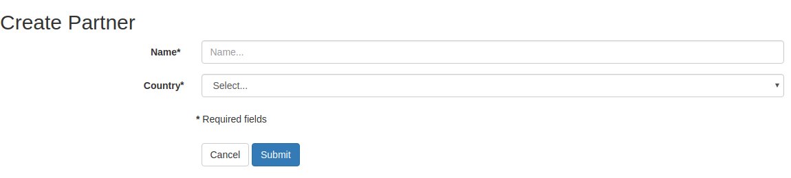
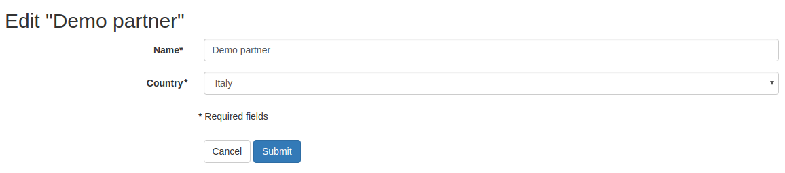
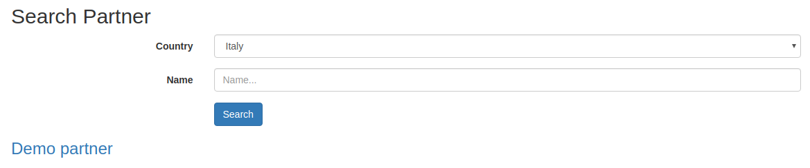

.. image:: https://img.shields.io/badge/licence-lgpl--3-blue.svg
   :target: http://www.gnu.org/licenses/LGPL-3.0-standalone.html
   :alt: License: LGPL-3

CMS Form
========

Basic website contents form framework. Allows to define front-end forms for every models in a simple way.

If you are tired of re-defining every time an edit form or a search form for your odoo website,
this is the module you are looking for.

Features
========

* automatic form generation (create, write, search)
* automatic route generation (create, write, search)
* automatic machinery based on fields' type:
    * widget rendering
    * field value load (from existing instance or from request)
    * field value extraction (from request)
    * field value write (to existing instance)

* highly customizable
* works with every odoo model
* works also without any model
* add handy attributes to models inheriting from ``website.published.mixin``:
    * ``cms_add_url``: lead to create form view. By default ``/cms/form/create/my.model``
    * ``cms_edit_url``: lead to edit form view. By default ``/cms/form/edit/my.model/model_id``
    * ``cms_search_url``: lead to search form view. By default ``/cms/form/search/my.model``

Usage
=====

Create / Edit form
------------------

Just inherit from ``cms.form`` to add a form for your model. Quick example for partner:

.. code-block:: python

    class PartnerForm(models.AbstractModel):

        _name = 'cms.form.res.partner'
        _inherit = 'cms.form'
        _form_model = 'res.partner'
        _form_model_fields = ('name', 'country_id')
        _form_required_fields = ('name', 'country_id')


In this case you'll have form with the following characteristics:

* works with ``res.partner`` model
* have only ``name`` and ``country_id`` fields
* both fields are required (is not possible to submit the form w/out one of those values)

Here's the result:

|preview_create|
|preview_edit|

The form will be automatically available on these routes:

* ``/cms/form/create/res.partner`` to create new partners
* ``/cms/form/edit/res.partner/1`` edit existing partners (partner id=1 in this case)

NOTE: default generic routes work if the form's name is ``cms.form.`` + model name, like ``cms.form.res.partner``.
If you want you can easily define your own controller and give your form a different name,
and have more elegant routes like ```/partner/edit/partner-slug-1``.
Take a look at `cms_form_example <../cms_form_example>`_.

By default, the form is rendered as an horizontal twitter bootstrap form, but you can provide your own templates of course.
By default, fields are ordered by their order in the model's schema. You can tweak it using ``_form_fields_order``.


Form with extra control fields
------------------------------

Imagine you want to notify the partner after its creation but only if you really need it.

The form above can be extended with extra fields that are not part of the ``_form_model`` schema:

.. code-block:: python

    class PartnerForm(models.AbstractModel):

        _name = 'cms.form.res.partner'
        _inherit = 'cms.form'
        _form_model = 'res.partner'
        _form_model_fields = ('name', 'country_id', 'email')
        _form_required_fields = ('name', 'country_id', 'email')

        notify_partner = fields.Boolean()

        def form_after_create_or_update(self, values, extra_values):
            if extra_values.get('notify_partner'):
                # do what you want here...

``notify_partner`` will be included into the form but it will be discarded on create and write.
Nevertheless you can use it as a control flag before and after the record has been created or updated
using the hook ``form_after_create_or_update``, as you see in this example.


Search form
-----------

Just inherit from ``cms.form.search`` to add a form for your model. Quick example for partner:

.. code-block:: python

    class PartnerSearchForm(models.AbstractModel):
        """Partner model search form."""

        _name = 'cms.form.search.res.partner'
        _inherit = 'cms.form.search'
        _form_model = 'res.partner'
        _form_model_fields = ('name', 'country_id', )
        _form_fields_order = ('country_id', 'name', )


|preview_search|

The form will be automatically available at: ``/cms/form/search/res.partner``.

NOTE: default generic routes work if the form's name is ```cms.form.search`` + model name, like ``cms.form.search.res.partner``.
If you want you can easily define your own controller and give your form a different name,
and have more elegant routes like ``/partners``.
Take a look at `cms_form_example`.


Master / slave fields
---------------------

A typical use case nowadays: you want to show/hide fields based on other fields' values.
For the simplest cases you don't have to write a single line of JS. You can do it like this:

.. code-block:: python

    class PartnerForm(models.AbstractModel):

        _name = 'cms.form.res.partner'
        _inherit = 'cms.form'
        _form_model = 'res.partner'
        _form_model_fields = ('name', 'type', 'foo')

        def _form_master_slave_info(self):
            info = self._super._form_master_slave_info()
            info.update({
                # master field
                'type':{
                    # actions
                    'hide': {
                        # slave field: action values
                        'foo': ('contact', ),
                    },
                    'show': {
                        'foo': ('address', 'invoice', ),
                    }
                },
            })
            return info

Here we declared that:

* when `type` field is equal to `contact` -> hide `foo` field
* when `type` field is equal to `address` or `invoice` -> show `foo` field


Known issues / Roadmap
======================

* add more tests, especially per each widget and type of field
* provide better widgets for image and file fields in general
* o2m fields: to be tested at all
* move widgets to abstract models too
* search form: generate default search domain in a clever way
* add easy way to switch from horizontal to vertical form
* provide more examples
* x2x fields: allow sub-items creation
* handle api onchanges
* support python expressions into master/slave rules


Bug Tracker
===========

Bugs are tracked on `GitHub Issues
<https://github.com/OCA/website-cms/issues>`_. In case of trouble, please
check there if your issue has already been reported. If you spotted it first,
help us smashing it by providing a detailed and welcomed feedback.

Credits
=======

Sponsor
-------

* `Fluxdock.io <https://fluxdock.io>`_.

Contributors
------------

* Simone Orsi <simone.orsi@camptocamp.com>

Maintainer
----------

.. image:: https://odoo-community.org/logo.png
   :alt: Odoo Community Association
   :target: https://odoo-community.org

This module is maintained by the OCA.

OCA, or the Odoo Community Association, is a nonprofit organization whose
mission is to support the collaborative development of Odoo features and
promote its widespread use.

To contribute to this module, please visit https://odoo-community.org.




