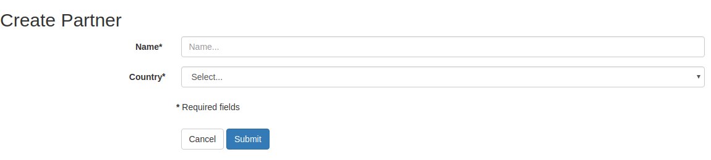
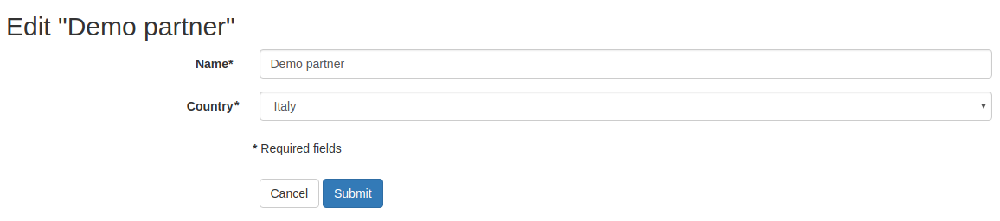
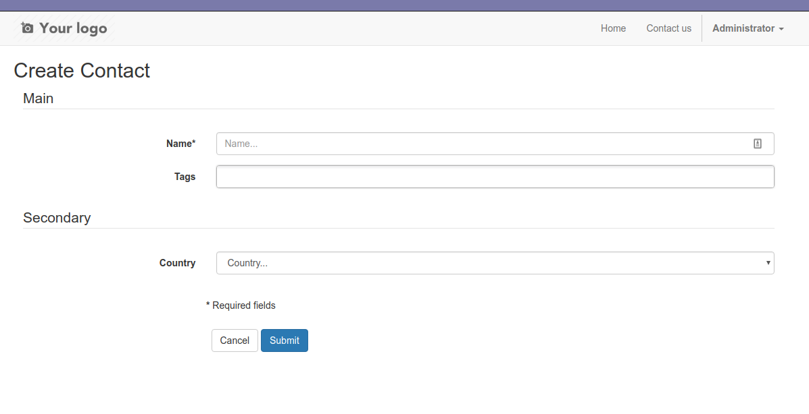

Form basics
===========

Create / Edit form
------------------

Just inherit from ``cms.form`` to add a form for your model. Quick example for partner:

.. code-block:: python

    class PartnerForm(models.AbstractModel):

        _name = 'cms.form.res.partner'
        _inherit = 'cms.form'
        _form_model = 'res.partner'
        _form_model_fields = ('name', 'country_id')
        _form_required_fields = ('name', 'country_id')


In this case you'll have form with the following characteristics:

* works with ``res.partner`` model
* have only ``name`` and ``country_id`` fields
* both fields are required (is not possible to submit the form w/out one of those values)

Here's the result:




The form will be automatically available on these routes:

* ``/cms/create/res.partner`` to create new partners
* ``/cms/edit/res.partner/1`` edit existing partners (partner id=1 in this case)

NOTE: default generic routes work if the form's name is ``cms.form.`` + model name, like ``cms.form.res.partner``.
If you want you can easily define your own controller and give your form a different name,
and have more elegant routes like ```/partner/edit/partner-slug-1``.
Take a look at `cms_form_example` module.

By default, the form is rendered as an horizontal twitter bootstrap form, but you can provide your own templates of course.
By default, fields are ordered by their order in the model's schema. You can tweak it using ``_form_fields_order``.


Form with extra control fields
------------------------------

Imagine you want to notify the partner after its creation but only if you really need it.

The form above can be extended with extra fields that are not part of the ``_form_model`` schema:

.. code-block:: python

    class PartnerForm(models.AbstractModel):

        _name = 'cms.form.res.partner'
        _inherit = 'cms.form'
        _form_model = 'res.partner'
        _form_model_fields = ('name', 'country_id', 'email')
        _form_required_fields = ('name', 'country_id', 'email')

        notify_partner = fields.Boolean()

        def form_after_create_or_update(self, values, extra_values):
            if extra_values.get('notify_partner'):
                self.something_to_do_in_this_case()

``notify_partner`` will be included into the form but it will be discarded on create and write.
Nevertheless you can use it as a control flag before and after the record has been created or updated
using the hook ``form_after_create_or_update``, as you see in this example.


Form with fieldsets and tabs
----------------------------

You want to group fields into meaningful groups. You can use fieldsets:

.. code-block:: python

    class PartnerForm(models.AbstractModel):

        _name = 'cms.form.res.partner'
        _inherit = 'cms.form'
        _form_model = 'res.partner'
        _form_model_fields = ('name', 'country_id', 'email')
        _form_required_fields = ('name', 'country_id', 'email')
        _form_fieldsets = [
            {
                'id': 'main',
                'title': 'Main',
                'fields': [
                    'name',
                    'email',
                ],
            },
            {
                'id': 'secondary',
                'title': 'Secondary',
                'fields': [
                    'country_id',
                    'notify_partner',
                ],
            },
        ]

        notify_partner = fields.Boolean()




If you want fieldsets to be displayed as tabs, just override this option:

.. code-block:: python

    class PartnerForm(models.AbstractModel):

        _name = 'cms.form.res.partner'
        _inherit = 'cms.form'
        _form_fieldsets = [...]
        _form_fieldsets_display = 'tabs'


.. image:: ./_static/images/cms_form_example_tabbed.png


Search form
-----------

Just inherit from ``cms.form.search`` to add a form for your model. Quick example for partner:

.. code-block:: python

    class PartnerSearchForm(models.AbstractModel):
        """Partner model search form."""

        _name = 'cms.form.search.res.partner'
        _inherit = 'cms.form.search'
        _form_model = 'res.partner'
        _form_model_fields = ('name', 'country_id', )
        _form_fields_order = ('country_id', 'name', )


The form will be automatically available at: ``/cms/search/res.partner``.

NOTE: default generic routes work if the form's name is ```cms.form.search`` + model name, like ``cms.form.search.res.partner``.
If you want you can easily define your own controller and give your form a different name,
and have more elegant routes like ``/partners``.
Take a look at `cms_form_example`.
