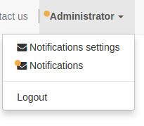
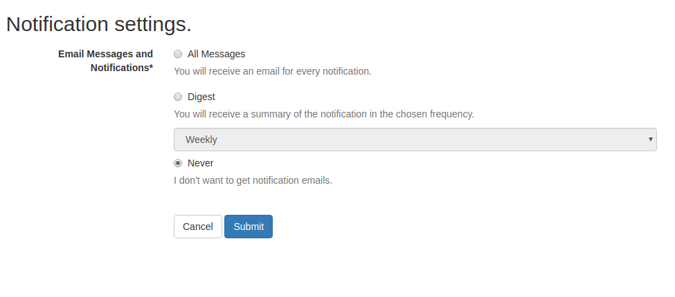
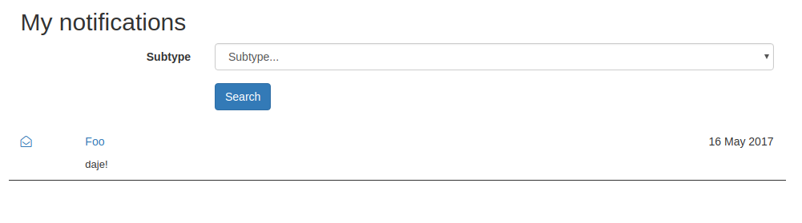

.. image:: https://img.shields.io/badge/licence-lgpl--3-blue.svg
   :target: http://www.gnu.org/licenses/LGPL-3.0-standalone.html
   :alt: License: LGPL-3

CMS notification
=================

Features
--------

Manage notifications in your CMS. Provides:

* menu item for settings
* menu item for notifications listing
* flag `has_unread_notif` on user to highlight when the user has an unread notification
* flag `cms_type` on message subtype to enable/disable visibility in CMS features (notifications listing for instance)

Depends on `mail_digest [WIP PR] <https://github.com/camptocamp/social/tree/add-mail_digest/mail_digest>`_
and `cms_form [WIP PR] <https://github.com/simahawk/website-cms/tree/add-cms_form-PR/cms_form>`_.

Default appearance
------------------

Customization
-------------

You can customize the form as specified in ``cms_form`` docs.
``cms_notification`` extends the form behavior allowing you to just
provide the fields you need and a mapping between fields and messages'
subtypes.

.. code:: python

    class CMSNotificationPanel(models.AbstractModel):
        _inherit = 'cms.notification.panel.form'

        enable_my_type = fields.Boolean(
            string='Enable my type notifications',
            help=("If active, you will receive notifications "
                  "about this type.")
        )
        enable_my_type2 = fields.Boolean(
            string='Enable my type 2 notifications',
            help=("If active, you will receive notifications "
                  "about this type 2.")
        )

        @property
        def _form_subtype_fields(self):
            res = super()._form_subtype_fields
            res.update({
                'enable_my_type': 'module.mt_mytype',
                'enable_my_type2': 'module.mt_mytype2',
            })
            return res

Usage
-----

To bring the user to her/his panel:

.. code:: html

    <a class="btn btn-default" href="/my/settings/notifications">Notifications</a>

To bring the user to her/his notifications:

.. code:: html

    <a class="btn btn-default" href="/my/notifications">Notification settings</a>

Bug Tracker
===========

Bugs are tracked on `GitHub Issues <https://github.com/OCA/website-cms/issues>`_. In
case of trouble, please check there if your issue has already been
reported. If you spotted it first, help us smashing it by providing a
detailed and welcomed feedback.

Credits
=======

Contributors
------------

-  Simone Orsi simone.orsi@camptocamp.com

Funders
-------

The development of this module has been financially supported by: `Fluxdock.io <https://fluxdock.io>`_.

Maintainer
----------

.. image:: https://odoo-community.org/logo.png
   :alt: Odoo Community Association
   :target: https://odoo-community.org

This module is maintained by the OCA.

OCA, or the Odoo Community Association, is a nonprofit organization
whose mission is to support the collaborative development of Odoo
features and promote its widespread use.

To contribute to this module, please visit https://odoo-community.org.
