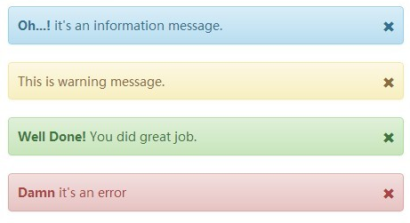

.. image:: https://img.shields.io/badge/licence-AGPL--3-blue.svg
   :target: http://www.gnu.org/licenses/agpl-3.0-standalone.html
   :alt: License: AGPL-3

==================
CMS status message
==================

Add status message to display to your CMS users.

A "status message" is an important message that you want to show to users.

For instance: a user submit a form or does a specific action
and you want to report the status of this action
like "your profile has been updated".

Messages are displayed using Twitter bootstrap alerts.

You can add several messages: they will be displayed one after another.

Usage
=====

Add status message to layout::

    <template id="add_status_message" inherit_id="website.layout" name="Add status message">

        <xpath expr="//div[@id='wrapwrap']/main/*" position="before">
            <t t-call="cms_status_message.status_message" />
        </xpath>

    </template>

Set a message::

    msg = _('My important message.')
    if request.website:
        request.website.add_status_message(msg)

By default the message type is `info`.
The title (the label at the beginning of the message) matches the message type:

    * 'info': 'Info'
    * 'success': 'Success'
    * 'danger': 'Error'
    * 'warning': 'Warning'

You can change message parameters::

    msg = _('Watch out!')
    if request.website:
        request.website.add_status_message(msg, mtype='warning', mtitle='Oh no')

Messages will be displayed like this:

|preview|

Bug Tracker
===========

Bugs are tracked on `GitHub Issues
<https://github.com/OCA/website-cms/issues>`_. In case of trouble, please
check there if your issue has already been reported. If you spotted it first,
help us smashing it by providing a detailed and welcomed feedback.

Credits
=======

Images
------

* Odoo Community Association: `Icon <https://github.com/OCA/maintainer-tools/blob/master/template/module/static/description/icon.svg>`_.

Contributors
------------

* Simone Orsi <simone.orsi@camptocamp.com>

Maintainer
----------

.. image:: https://odoo-community.org/logo.png
   :alt: Odoo Community Association
   :target: https://odoo-community.org

This module is maintained by the OCA.

OCA, or the Odoo Community Association, is a nonprofit organization whose
mission is to support the collaborative development of Odoo features and
promote its widespread use.

To contribute to this module, please visit https://odoo-community.org.

