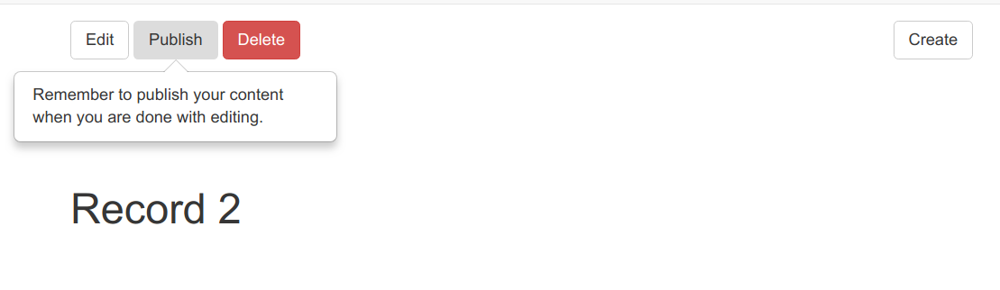

.. image:: https://img.shields.io/badge/licence-lgpl--3-blue.png
   :target: http://www.gnu.org/licenses/LGPL-3.0-standalone.html
   :alt: License: LGPL-3

===========
CMS Toolbar
===========

Render management actions for CMS contents.

Usage
-----

.. code:: xml

  <t t-raw="main_object.cms_render_toolbar()" />

You can override all the params. For instance if you don't want the popover:

.. code:: xml

  <t t-raw="main_object.cms_render_toolbar(show_popover=False)" />

Full list of params
-------------------

Default params from `cms_info`:

* `is_owner` 
* `can_edit` 
* `can_create` 
* `can_publish` 
* `can_delete` 
* `create_url` 
* `edit_url` 
* `delete_url` 

Extra params from `cms_toolbar`:

* `show_create` 
* `show_edit` 
* `show_delete` 
* `show_publish` 
* `show_popover` 
* `popover_content_template` 
* `main_object` 

Available actions/buttons
-------------------------

* create
* edit
* delete
* publish/unpublish

Also, there's a popover feature to remind users to publish contents.

Below you see the default rendering from `cms_toolbar_example`:

Bug Tracker
===========

Bugs are tracked on `GitHub Issues <https://github.com/OCA/website-cms/issues>`_.
In case of trouble, please check there if your issue has already been reported.

Credits
=======

Contributors
------------

* Simone Orsi <simone.orsi@camptocamp.com>

Maintainer
----------

.. image:: https://odoo-community.org/logo.png
   :alt: Odoo Community Association
   :target: https://odoo-community.org

This module is maintained by the OCA.

OCA, or the Odoo Community Association, is a nonprofit organization whose mission is to support the collaborative development of Odoo features and promote its widespread use.

To contribute to this module, please visit https://odoo-community.org.
